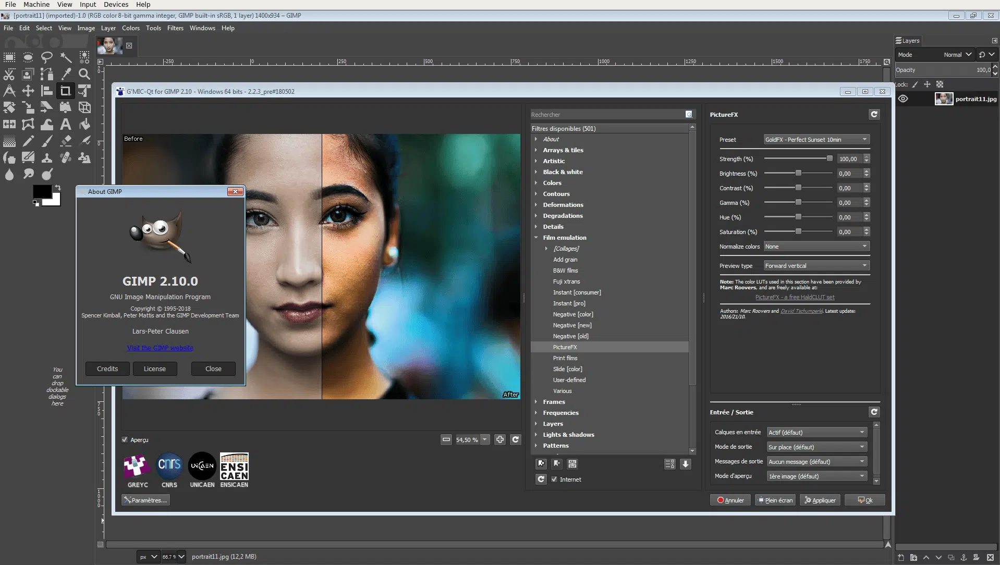

## The official page for installing Gimp

**Gimp** is a cross-platform image editor available for GNU/Linux, macOS, Windows and more operating systems.

Whether you are a graphic designer, photographer, illustrator, or scientist, GIMP provides you with sophisticated tools to get your job done. You can further enhance your productivity with GIMP thanks to many customization options and 3rd party plugins.

## To download Gimp from GitHub, simply follow these steps:

**1.** Click the download button on the Gimp GitHub page.

**2.** After clicking the button, you’ll see the download start in the top-right corner of your browser.

**3.** Once the download is complete, open the file to install Acrobat Reader on your computer.

**4.** Once installed, you'll be able to work with your PDFs with ease!

### Why Choose Gimp

1. ⭐️**Original Artwork Creation** – GIMP gives artists the power and flexibility to transform images into truly unique creations.
2. ⭐️**High Quality Photo Manipulation** – GIMP provides the tools needed for high quality image manipulation.
3. ⭐️**Graphic Design Elements** – GIMP is used for producing icons, graphical design elements. 
4. ⭐️**Programming Algorithms** – GIMP is a high quality framework for scripted image manipulation.

